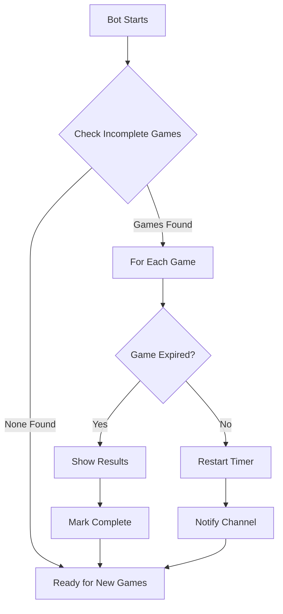

# 🎮 Synx Tournaments - Split & Steal Bot

A Discord bot for hosting **Split & Steal** tournament games with Supabase persistence and restart-safe interactions.


## 🎯 Features

- **🎮 Split & Steal Game** - Classic prisoner's dilemma style game
- **⏱️ Customizable Timer** - Set timer duration (10-300 seconds, default: 60s)
- **💎 Prize System** - Optional prize details with name, value, and description
- **📊 Result Modes**:
  - `After Timer Ends` - Results shown when timer expires
  - `When Both Click` - Results shown as soon as both players choose
- **🔄 Restart Safe** - All games persist through bot restarts via Supabase
- **💾 Interaction Persistence** - Button clicks saved to prevent duplicate processing
- **📈 Game History** - All games stored in database for analytics

## 🚀 Quick Start

### 1. Prerequisites

- Node.js 18+ or Bun
- Discord Bot Token (from [Discord Developer Portal](https://discord.com/developers/applications))
- Supabase Project (free at [supabase.com](https://supabase.com))

### 2. Setup Supabase

1. Create a new project at [supabase.com](https://supabase.com)
2. Go to SQL Editor and run the schema from [`database/schema.sql`](database/schema.sql):
   ```sql
   -- Copy contents of database/schema.sql and run it
   ```
3. Get your credentials:
   - **Project URL**: Settings → API → URL
   - **Anon Key**: Settings → API → public anon key

### 3. Configure Environment

```bash
cp .env.example .env
```

Edit `.env` with your values:

```env
# Discord Bot Configuration
DISCORD_TOKEN=your_discord_bot_token_here
CLIENT_ID=your_discord_client_id_here
GUILD_ID=your_guild_id_here

# Supabase Configuration
SUPABASE_URL=https://your-project.supabase.co
SUPABASE_ANON_KEY=your_supabase_anon_key_here

# Default Timer (seconds)
DEFAULT_TIMER_SECONDS=60
```

### 4. Install Dependencies

```bash
bun install
# or
npm install
```

### 5. Run the Bot

```bash
# Development mode (with hot reload)
bun run dev

# Production mode
bun run start
```

## 📖 Commands

### `/splitandsteal`

Start a new Split & Steal game!

| Option | Type | Required | Description |
|--------|------|----------|-------------|
| `player1` | User | ✅ | First player |
| `player2` | User | ✅ | Second player |
| `prize_name` | String | ❌ | Name of prize |
| `prize_value` | String | ❌ | Value of prize |
| `prize_description` | String | ❌ | Prize details |
| `timer` | Integer (10-300) | ❌ | Timer in seconds |
| `result_mode` | String | ❌ | `timer_end` or `both_clicked` |

#### Examples:

```bash
# Basic game
/splitandsteal @Player1 @Player2

# With prize details
/splitandsteal @Player1 @Player2 prize_name:"Nitro" prize_value:"1 Month"

# Full configuration
/splitandsteal @Player1 @Player2 \
  prize_name:"Cash Prize" \
  prize_value:"₹1000" \
  prize_description:"Winner takes all!" \
  timer:120 \
  result_mode:"both_clicked"
```

### `/synx-help`

Show help information and available commands.

## 🎮 How It Works

### Game Flow

```
┌─────────────────┐     ┌──────────────────┐     ┌─────────────────┐
│  Admin starts   │────▶│  Players choose  │────▶│  Results shown  │
│     game        │     │  SPLIT or STEAL  │     │                 │
└─────────────────┘     └──────────────────┘     └─────────────────┘
        │                       │                        │
        ▼                       ▼                        ▼
   Embed sent           Buttons clicked          Winner announced
   with game info       Choices saved            Prize distributed
```

### Result Matrix

| Player 1 \ Player 2 | 🤝 SPLIT | 💀 STEAL |
|---------------------|----------|----------|
| **🤝 SPLIT**        | 50% / 50% ✅ | 0% / 100% 💀 |
| **💀 STEAL**        | 100% / 0% 💀 | 0% / 0% ❌ |

### Scenarios

1. **Both SPLIT** (✅) - Prize split equally (50-50)
2. **Both STEAL** (❌) - Nobody wins anything
3. **One Splits, One Steals** (💀) - **Stealer takes everything!**

## 🗄️ Database Schema

### Games Table

Stores all game sessions with full state tracking.

```typescript
interface Game {
  id: string;              // UUID primary key
  channel_id: string;      // Where game was created
  message_id: string;      // Game embed message
  
  // Players
  player1_id: string;
  player1_username: string;
  player2_id: string;
  player2_username: string;
  
  // Prize
  prize_name?: string;
  prize_value?: string;
  prize_description?: string;
  
  // Timing
  timer_seconds: number;
  started_at: Date;
  ends_at?: Date;
  
  // Config
  result_mode: 'timer_end' | 'both_clicked';
  status: 'waiting' | 'in_progress' | 'completed' | 'cancelled';
  
  // Choices & Results
  player1_choice?: 'split' | 'steal';
  player2_choice?: 'split' | 'steal';
  winner_id?: string;
  result_type?: string;
  player1_prize_share?: number;
  player2_prize_share?: number;
}
```

### Interactions Table

Stores all button interactions for restart safety.

```typescript
interface Interaction {
  id: string;
  game_id: string;
  interaction_id: string;    // Discord interaction ID
  interaction_token: string; // For follow-up messages
  user_id: string;
  custom_id: string;         // Button identifier
  processed: boolean;        // Prevents double-processing
}
```

## 🔧 Architecture

```
src/
├── index.ts                    # Bot entry point & command registration
├── commands/
│   └── splitAndSteal.ts        # /splitandsteal command handler
├── events/
│   └── buttonHandler.ts        # Button click handler
├── utils/
│   ├── results.ts              # Result calculation logic
│   └── recovery.ts             # Post-restart recovery system
└── database/
    ├── client.ts               # Supabase client setup
    └── operations.ts           # Database CRUD operations
```

## 🔄 Restart Safety

The bot is designed to survive restarts without losing game state:

1. **Game State Persistence**: All active games stored in Supabase
2. **Interaction Tracking**: Every button click saved before processing
3. **Auto-Recovery**: On startup, bot checks for incomplete games:
   - Resumes timers for ongoing games
   - Shows results for expired games
   - Cancels corrupted games gracefully

### Recovery Process



## ⚙️ Configuration

### Environment Variables

| Variable | Required | Default | Description |
|----------|----------|---------|-------------|
| `DISCORD_TOKEN` | ✅ | - | Discord bot token |
| `CLIENT_ID` | ✅ | - | Application client ID |
| `GUILD_ID` | ❌ | - | Guild ID for dev commands |
| `SUPABASE_URL` | ✅ | - | Supabase project URL |
| `SUPABASE_ANON_KEY` | ✅ | - | Supabase public key |
| `DEFAULT_TIMER_SECONDS` | ❌ | 60 | Default timer duration |

### Timer Limits

- **Minimum**: 10 seconds
- **Maximum**: 300 seconds (5 minutes)
- **Default**: 60 seconds (configurable)

## 🛡️ Security Features

- **Interaction Deduplication**: Each interaction ID tracked to prevent replay attacks
- **Player Validation**: Only designated players can click their buttons
- **Choice Locking**: Players cannot change their choice after selecting
- **Rate Limiting**: One active game per channel
- **Input Sanitization**: All user inputs validated and sanitized

## 🐛 Troubleshooting

### Common Issues

**Bot not responding to commands**
- Check if token is correct in `.env`
- Verify bot has proper permissions
- Ensure commands are registered (check console logs)

**Supabase connection errors**
- Verify `SUPABASE_URL` and `SUPABASE_ANON_KEY`
- Check if schema was executed in SQL Editor
- Confirm RLS policies allow access

**Buttons not working after restart**
- This is normal! Recovery system handles it
- Check console for recovery logs
- Interactions are reprocessed automatically

**Timer not ending game**
- Check if `result_mode` is set to `timer_end`
- Verify timer value is within limits (10-300s)
- Check Supabase for game status updates

### Debug Mode

Enable verbose logging by setting:

```env
LOG_LEVEL=debug
```

## 📝 License

MIT License - feel free to use, modify, and distribute!

## 🤝 Contributing

Contributions welcome! Please read our contributing guidelines before submitting PRs.

---

**Made with ❤️ by Synx Tournaments Team**

For support, join our [Discord Server](https://discord.gg/synx) or open an issue!
